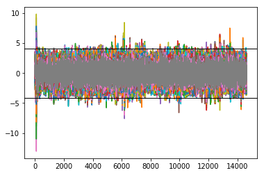
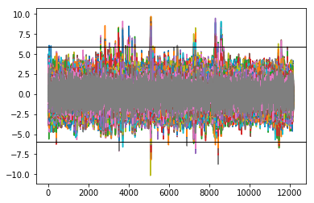
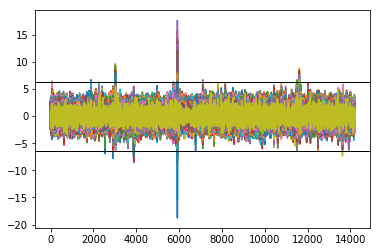

# Materials for Paper "Conducting and Analyzing Human Studies: The Role of Variation and Aggregation"

# Literature Survey

We provide a list with all reviewed studies including our assessment comments and explanations in `literature_review.tsv`.

We like to note that we defined the term `empirical` broadly and thus included many studies that would not hold a strict definition of empirical study.

Here is a broad summary of the results:

| Venue | Year | Papers | Empirical | Human | Tasks | Aggregated | Single | Both | Other|  
|---|---|---|---|---|---|---|---|---|---|
| ICSE | 2011 | 61 | 61 | 13 | 3 | 1 | 0 | 2 | 0 |
| ICSE | 2012 | 82 | 82 | 24 | 14 | 8 | 3 | 2 | 1 |
| ICSE | 2013 | 106 | 106 | 36 | 9 | 3 | 2 | 3 | 1 |
| ICSE | 2014 | 99 | 96 | 28 | 15 | 6 | 0 | 5 | 4 |
| ICSE | 2015 | 84 | 83 | 19 | 9 | 5 | 1 | 2 | 1 |
| ICSE | 2016 | 101 | 101 | 26 | 8 | 2 | 1 | 4 | 1 |
| ICSE | 2017 | 68 | 68 | 20 | 10 | 6 | 3 | 1 | 0 |
| ICSE | 2018 | 105 | 105 | 29 | 9 | 2 | 4 | 1 | 2 |
| FSE | 2011 | 34 | 34 | 2 | 0 | 0 | 0 | 0 | 0 |
| FSE | 2012 | 34 | 34 | 5 | 2 | 1 | 0 | 0 | 1 |
| FSE | 2013 | 51 | 51 | 2 | 2 | 0 | 2 | 0 | 0 |
| FSE | 2014 | 61 | 60 | 13 | 3 | 0 | 1 | 2 | 0 |
| FSE | 2015 | 74 | 74 | 18 | 7 | 1 | 3 | 3 | 0 |
| FSE | 2016 | 73 | 73 | 11 | 3 | 1 | 0 | 1 | 1 |
| FSE | 2017 | 72 | 72 | 9 | 4 | 2 | 1 | 1 | 0 |
| FSE | 2018 | 61 | 61 | 10 | 2 | 0 | 0 | 2 | 0 |
| EMSE | 2011 | 25 | 25 | 7 | 2 | 1 | 0 | 0 | 1 |
| EMSE | 2012 | 24 | 24 | 5 | 3 | 1 | 0 | 1 | 1 |
| EMSE | 2013 | 31 | 31 | 6 | 3 | 2 | 1 | 0 | 0 |
| EMSE | 2014 | 53 | 53 | 29 | 16 | 14 | 1 | 1 | 0 |
| EMSE | 2015 | 50 | 50 | 20 | 13 | 9 | 0 | 3 | 1 |
| EMSE | 2016 | 64 | 64 | 15 | 7 | 1 | 1 | 4 | 1 |
| EMSE | 2017 | 78 | 78 | 24 | 9 | 3 | 0 | 6 | 0 |
| EMSE | 2018 | 93 | 93 | 26 | 9 | 2 | 0 | 4 | 3 |
| Combined | | 1584 | 1579 | 397 | 165 | 71 | 22 | 51 | 19

# Reanalysis with Aggregation of Studies from Literature Survey

## Study 1: Does organizing security patterns focus architectural choices?

Paper's Web site: https://distrinet.cs.kuleuven.be/software/securitypatterns/

For reanalysis of both, time and efficiency, we removed outliers according to Figures 2 and 3 of the original paper, and we removed all rows that belonged to Task A, which was the warm up task and was ignored for the analysis.

Time: The according file for reanalysis is available at: https://distrinet.cs.kuleuven.be/software/securitypatterns/effort.csv
(we used the term time, instead of effort, to be consistent within our paper). We computed the sum of the three last columns denoting the completing time (i.e, "STUDY_REQUIREMENT","CREATING_SHORTLIST", and "FINAL_SELECTION"). We used only this sum as a new column from now on. Furthermore, we removed all columns except the column "Group", which denotes whether participants worked with or without structured security patterns. Thus, the input data consisted of just two columns: Group and Sum. Then, we tested for normal distribution and conducted the Wilcoxon test, since data are not normally distributed (these two steps are available in the jupyter notebook `/reanalysis/Reanalysis.ipynb`; for the other steps, we used Excel).

Efficiency: The according data set is available at:
https://distrinet.cs.kuleuven.be/software/securitypatterns/efficiency.csv
For efficiency, we divided column NFINAL by NVIEWED, and we also just have two columns: Group and Values (i.e., the result of NFINAL/NVIEWED). Then, we tested for normal distribution and conducted the Wilcoxon test, since data are not normally distributed (these two steps are available in the jupyter notebook `/reanalysis/Reanalysis.ipynb`).

## Study 2: Do background colors improve program comprehension in the #ifdef hell?

Paper's Web site: http://fosd.net/experiments

There is one excel file with all the relevant data: https://www.infosun.fim.uni-passau.de/se/janet/colors/workingset1.xls

Time: We computed the arithmetic mean for all static and maintenance tasks. The jupyter notebook `/reanalysis/Reanalysis.ipynb` contains the reanalysis of the response times on the aggregated data.

Correctness: We summarized the correctness according to Figure 5 of the [original paper](https://link.springer.com/article/10.1007/s10664-012-9208-x). In the jupyter notebook `/reanalysis/Reanalysis.ipynb`, we provide the results of the according chi^2 test.

## Study 3: Do developers read compiler error messages?

Paper's Web site: http://static.barik.net/barik/gazerbeams/

For reanalysis, we aggregated the gaze data of participants according to Tables 1 (task categories), 2 (correctness), and 3 (gaze behavior) of the original paper. The reanalsis is available in the jupyter notebook `/reanalysis/Reanalysis.ipynb`.

# Levels of Aggregation

## Software Setup

* Python 3.3
* Jupyter notebooks

Each folder contains the scripts and generated learning pipelines for the according study. If you just want to run the generated tpot scripts, that is, execute the optimal learning pipeline for each input data set, there is no need to install tpot.

To this end, you need to adapt each notebook with 'Prediction' in the name. You need to remove the following commands:

```
from tpot import TPOTClassifier

tpot = TPOTClassifier(generations=5, population_size=20, verbosity=2, n_jobs=20)
tpot.fit(training_features, training_target)
print(tpot.score(testing_features, testing_target))
tpot.export(fileNameTPot + '.py')"
```

After that, you can run the ExecuteNotebook in each folder (i.e., ICSE, FSE, ESEM). Since only the prediction is executed, it should not take more than a few hours.

Be sure to have write permission, as several files are created during the generation and prediction.

For generating the learning pipelines, tpot is necessary: http://epistasislab.github.io/tpot/installing/

We also installed XGBoost. For each input set, tpot automatically finds the optimal learning pipeline, including hyper parameters. You also need to run the ExecuteNotebook in each folder, but without adapting anything. Depending on the performance of the computer, it takes a day until all generation and learning is completed. You can reduce that time by reducing the number of generations and population_size (but this may lead to less optimal learing pipelines) or increase n_jobs (to the number of cpus/gpus that you can use at the same time).

Note that there is also some randomness in the tpot approach, running it again may not lead to the same learning pipelines that we used.

## Outlier Removal and Plots

For each of the three fMRI studies, we show the z-transformed data of the voxels. The x axis shows all scans of each participant (e.g., there are 900 scans for the ICSE study, and 16 participants, so this translates to 900 x 16 = 14 000 values on the x-axis). The y axis shows the activation values of each voxel, after z transformation.

### ICSE '14


### FSE '17


### ESEM '18


In the sense of transparent and replicable science, we are doing our best to provide all necessary information on this Web site. Please contact us if you run into any troubles!
